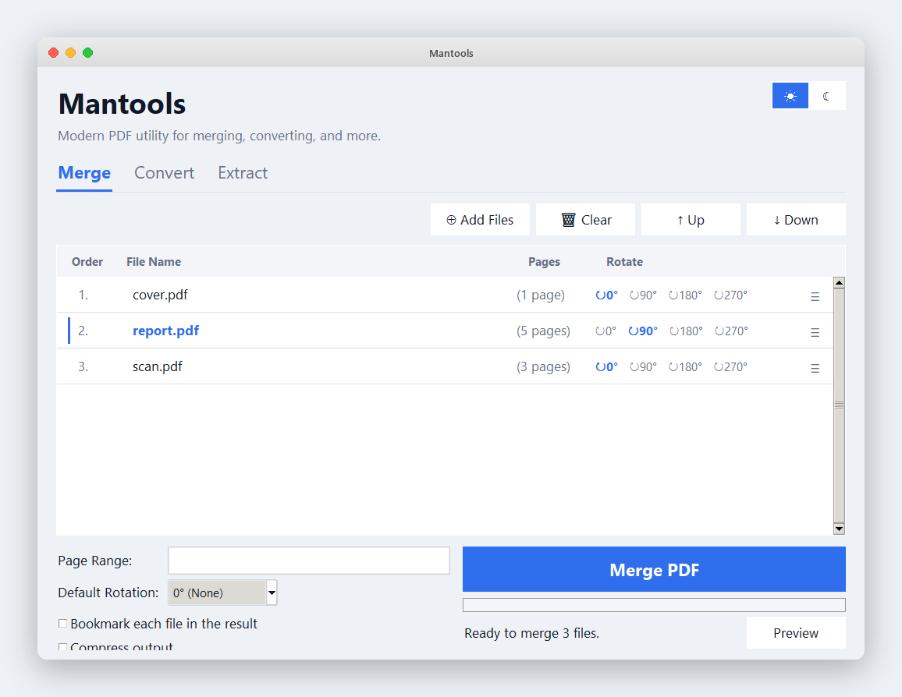

# Mantools — macOS installer

Installs Mantools for the current user (no `sudo`) as
`~/Applications/Mantools.app`.

## Preview



*Mantools on macOS. The interface is identical on every platform — light and
dark themes, and the Merge / Convert / Extract tabs; only the window chrome
differs per OS.*

## Install
In Terminal (recommended, since downloaded scripts aren’t executable yet):

```bash
cd MacOS
chmod +x install.command uninstall.command
./install.command
```

(Or after `chmod +x`, double-click `install.command` in Finder.)

What it does:
- checks for Python 3.8+ (`python3`),
- creates a private virtual environment under
  `~/Library/Application Support/Mantools/venv`,
- installs the dependencies from `requirements.txt`,
- builds a real **`Mantools.app`** bundle with the `mantools.icns` icon.

Then open **Mantools** from `~/Applications` (double-click) or drag it to the Dock.

## Requirements
- **Python 3.8+** — from <https://www.python.org/downloads/macos/> (bundles Tk),
  or Homebrew: `brew install python` **and** `brew install python-tk`.
- Internet access the first time (to download the Python packages).
- **Office → PDF** conversions require Microsoft Office **on Windows** and are
  automatically disabled on macOS. Everything else (merge, PDF→Office, extract)
  works.

## Uninstall
```bash
./uninstall.command
```

## Gatekeeper note
The app isn’t code-signed. If macOS blocks the first launch, right-click
`Mantools.app` → **Open** → **Open**, or allow it under
System Settings → Privacy & Security.
